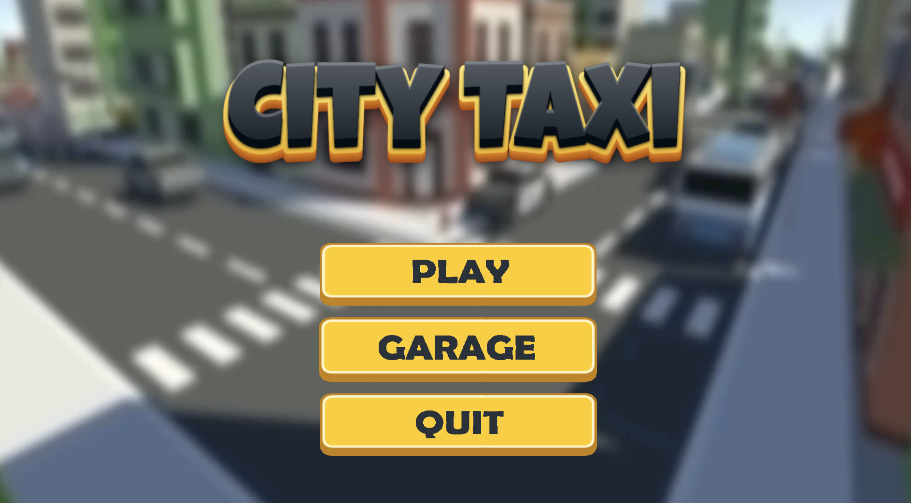
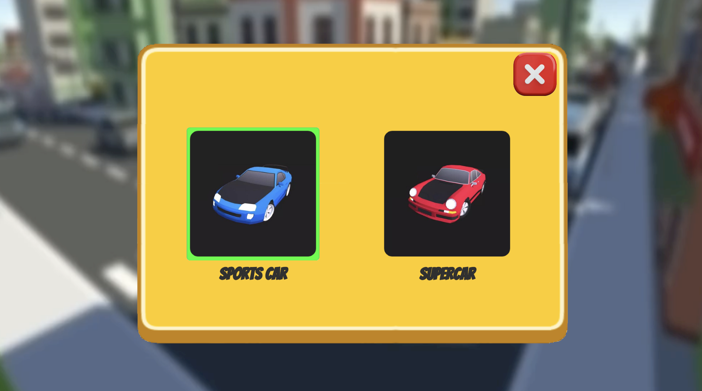
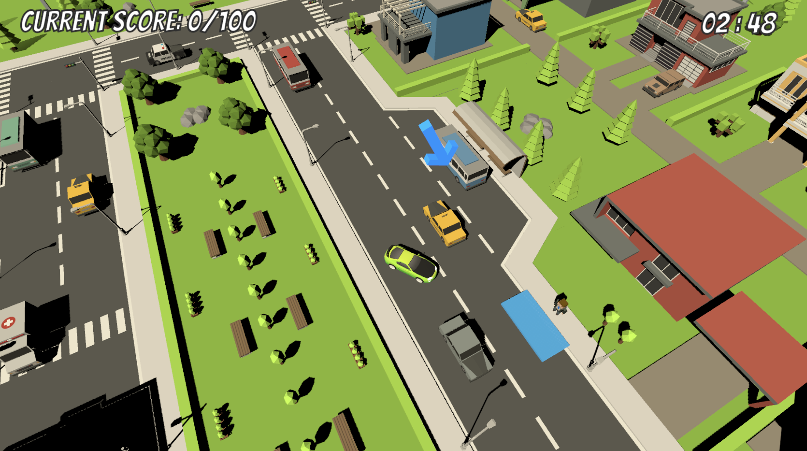
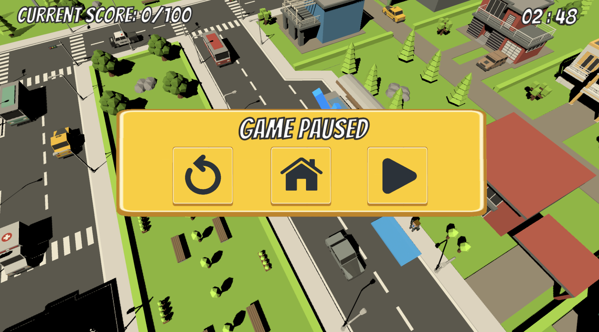

# TaxiCity

**TaxiCity** is a 3D top-down Unity-based game where you play as a taxi driver. The objective is to transport passengers to their destinations between checkpoints while navigating traffic, avoiding collisions, and racing against the clock.

---
## Screenshots

---

## Features
- **Vehicle Selection**: Choose between two different cars with different stats.
- **Dynamic Checkpoints**: Randomly generated checkpoints, and passengers.
- **Score System**:
  - Earn 30 points for each successful delivery.
  - Lose points for collisions:
    - Small objects: -1 point (can collide once; objects break after the first hit).
    - Cars/large objects: -3 points (can collide multiple times).
- **Timer-Based Objective**: Deliver passengers and reach the target score within the time limit, or lose the game.
- **Pause Menu**: Resume, restart, or return to the main menu at any time.
- **Guiding Arrow**: An arrow above the player always points to the next checkpoint.
- **Animated Main Menu**: Select your car and start the game in style with a sleek animated background.

---

## How to Play
1. **Start the Game**: Select your car from the main menu and begin the game.
2. **Follow the Arrow**: Follow the  arrow above the car to navigate to the next checkpoint.
3. **Pick up the passenger**: Stop at the checkpoint to pick up the passengers
4. **Deliver the passenger**: Deliver passengers to earn points, and avoid collisions to prevent losing points.
5. Achieve the target score before the timer runs  out to win the game.

---

## Controls
- **Movement**: Use the arrow keys or `WASD` to drive.
- **Pause**: Press `Escape` to open the pause menu.

---

## Requirements
- **Unity Version**: This project was built with **Unity Editor 2022.3.26f1**. Ensure you're using this version or later for optimal compatibility.
- **Environment**: Windows/macOS/Linux.

---

## Installation and Setup
1. Clone this repository to your local machine.
2. Open the project in Unity Editor (2022.3.26f1 or later).
3. Press `Play` in the Unity Editor to run the game, or build it for your target platform. (Windows/Linux/Mac)

---

## License
This project is open-source and licensed under the [MIT License](LICENSE).

Enjoy the ride and good luck being the best taxi driver in town!

